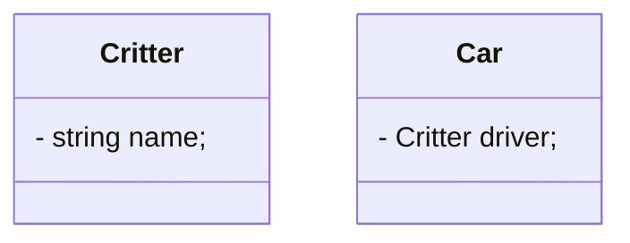

# directory for c++ files
## program descriptions
* **hello.cpp and helloBetter.cpp**: Simple c++ programs, both ask the user to input their name and prints a greeting. helloBetter.cpp works the same way as hello.cpp, just without "using namespace std".
* using Mermaid diagrams

